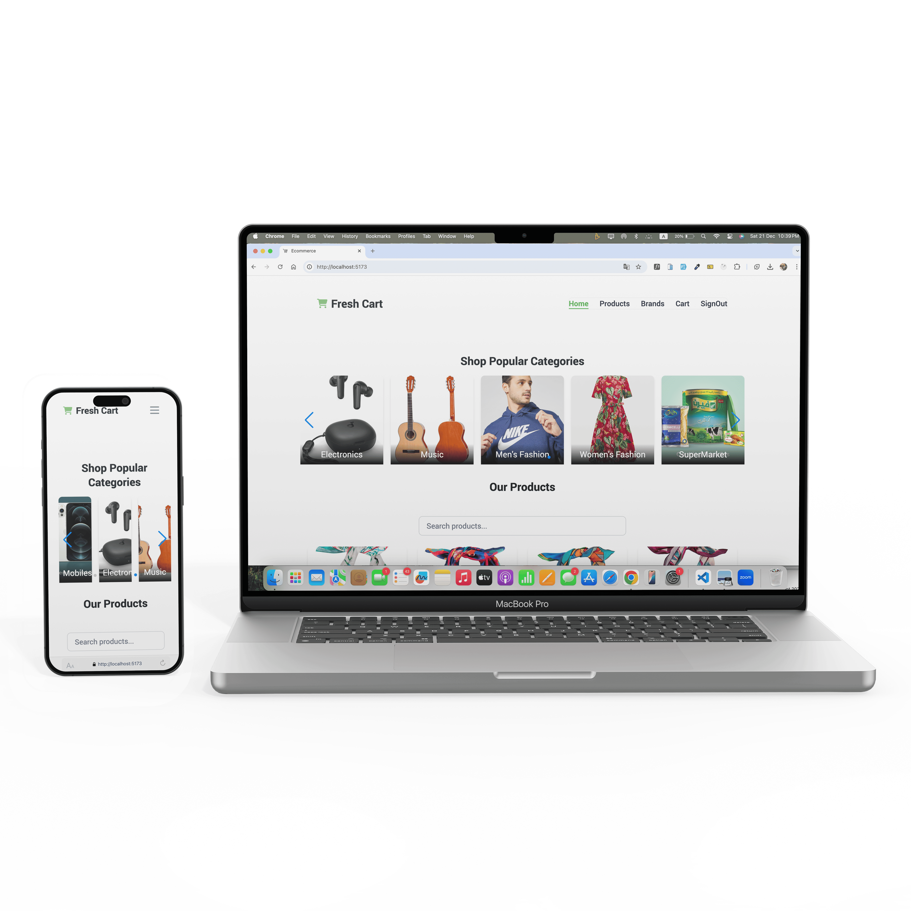

# E-Commerce Website

This is a fully responsive E-Commerce application built using modern web technologies. It integrates real-world APIs, provides a seamless shopping experience, and includes dynamic cart functionality.

---

## 🛒 Features

This E-Commerce project is packed with powerful features designed to deliver an exceptional user experience:

- **📖 Multi-Page Layout**:

  - Pages include **Home**, **Products**, **Brands**, **Product Details**, and **Cart**.
  - Each page is dynamically loaded with data from live APIs.

- **🎨 Beautiful UI with Tailwind CSS**:

  - Clean, modern, and mobile-first design.
  - Easily customizable with Tailwind's utility-first framework.
  - Fully responsive layout ensures compatibility with all screen sizes.

- **🔍 Real API Integration**:

  - Data is fetched in real-time from the [Route Misr E-Commerce API](https://ecommerce.routemisr.com).

- **🛠 Dynamic Cart Functionality**:

  - Users can **add**, **remove**, and **update** products in the cart.
  - Real-time updates for subtotal, shipping, tax, and total.
  - Full validation for prices and quantities.

- **🌟 Product Reviews & Ratings**:

  - Display product reviews and ratings.
  - Star icons for rating visuals (using HeroIcons).

- **🛍 Brand-Specific Pages**:

  - Products are grouped by brand.
  - Navigate to brand pages to view specific products.

- **💡 Notifications**:

  - Instant notifications for actions like adding/removing products from the cart.

- **📱 Fully Responsive**:

  - Designed with a mobile-first approach to ensure usability across all devices.

- **🔄 Hover Effects**:

  - Smooth hover animations for product images, buttons, and navigation links.

- **🛒 Cart Badge**:

  - A dynamic badge displays the current number of items in the cart.

- **⚡ Optimized Performance**:

  - Lazy loading for product images to improve load times.

- **🔐 Authentication Support**:
  - Login and sign-up functionality for personalized user experiences (extendable).

---

## 💻 Built With

This E-Commerce application is built using modern and powerful technologies:

- **React.js**:

  - A declarative, efficient, and flexible JavaScript library for building user interfaces.
  - Component-based architecture for reusable UI components.

- **React Router**:

  - For managing navigation and routing between pages.

- **Axios**:

  - HTTP client for making API requests.
  - Used to fetch products, brands, and other data from the backend.

- **Tailwind CSS**:

  - A utility-first CSS framework for styling the application.
  - Provides responsive design and easy customization.

- **FontAwesome Icons**:

  - Used for attractive and meaningful icons in the app.

- **HeroIcons**:

  - SVG-based icons for enhanced visual appeal.

- **React Spinners**:

  - Beautiful loading spinners to improve user experience during data fetching.

- **Context API**:

  - Used to manage global states like cart data and user authentication seamlessly.

- **JavaScript ES6+**:

  - Leveraging modern JavaScript features for clean and efficient code.

- **Node.js**:

  - For building backend and middleware services (extendable for future APIs).

- **Express.js**:

  - Extendable backend technology to handle routing and middleware logic.

- **VS Code**:

  - Code editor used for the project.

- **Vercel**:
  - Platform used for deploying the application with live updates.

---

## 📂 Project Structure

- **`/src/components`**: Contains all React components such as Navbar, ProductCard, and BrandDetails.
- **`/src/pages`**: Contains the main pages (Home, Products, Cart, etc.).
- **`/src/context`**: Includes Context APIs for managing global state like Cart and Authentication.
- **`/src/assets`**: Contains static assets like images and icons.

---

## 📸 Screenshots

### Home Page

### Product Page

### Cart Page

---

## 🛠 Future AI Features

This project is designed to incorporate AI-powered features to further enhance the shopping experience:

1. **AI-Powered Recommendations**:

   - Display personalized product recommendations based on user purchase and browsing history.
   - Machine learning algorithms will improve the relevance of suggestions.

2. **Smart Search**:

   - An AI-enhanced search engine to better understand user intent and provide more accurate results.

3. **Chatbot Integration**:

   - Implement AI chatbots to provide 24/7 customer support.
   - Assist with product queries, order tracking, and more.

4. **Dynamic Pricing**:
   - Use AI algorithms to optimize pricing based on demand and inventory.

---

## ⭐ Show Your Support

Give a ⭐ if you like this project!

 &nbsp;
 &nbsp;

